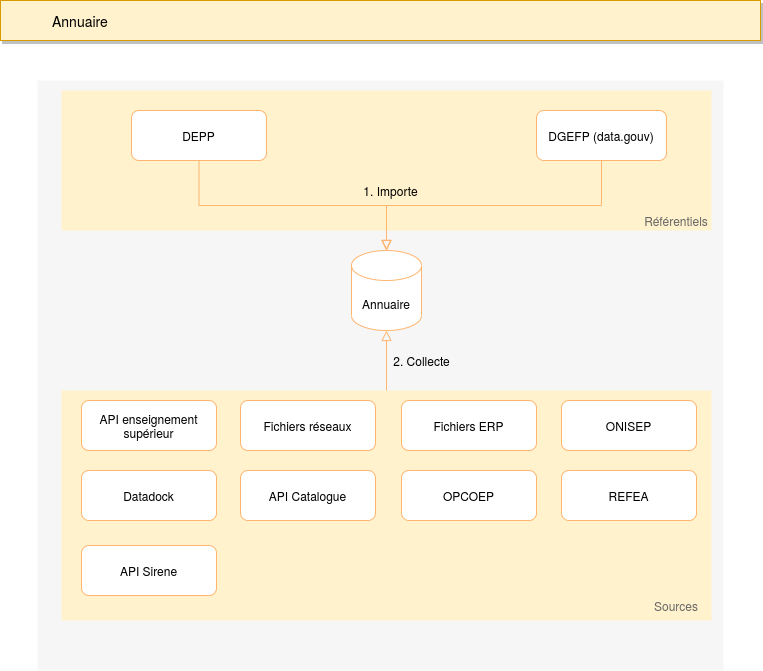

# Annuaire

L'annuaire regroupe les établissements qui dispensent des formations en apprentissage.

Cet annuaire se base sur deux listes d'établissements fournies par la DEPP et la DGEFP. Ces listes sont
appelées `référentiel` et sont importées dans l'annuaire au moyen de scripts.

Pour chacun des établissements importés, des scripts vont ensuite collecter des informations dans les différentes
sources dont la mission apprentissage dispose :

- API Enseignement supérieur
- Fichiers réseaux
- Datadock
- Catalogue des formations
- Fichiers ERP
- ONISEP
- REFEA
- API Sirene

## API

L'api permet de consulter les établissements issus des référentiels ainsi que les données collectées dans les sources.
Cet API est actuellement composée de deux routes.

### /etablissements

Permet de lister les établissements contenus dans l'annuaire

Exemple : https://tables-correspondances.apprentissage.beta.gouv.fr/api/v1/annuaire/etablissements

### /etablissements/:siret

Permet d'obtenir les informations relatives à un établissement à partir de son numéro de SIRET

Exemple : https://tables-correspondances.apprentissage.beta.gouv.fr/api/v1/annuaire/etablissements/77928324100056

